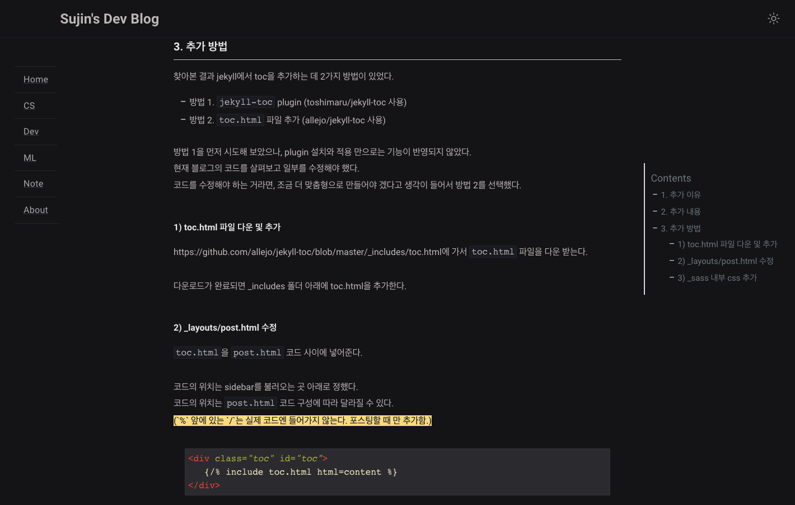

> _git pages based on [klisé theme](https://github.com/piharpi/jekyll-klise)_
---

---

### Main Features
1. menu left side bar
1. 2-level categorization
1. toc right side bar
1. comments by utteranc.es
1. light/dark mode

---

### Todo List

- [ ] tag별 배경 색 지정
- [ ] 포스트 커버 이미지 추가
- [ ] search 동작하도록
- [ ] portfolio 페이지 추가
- [ ] /about/ timeline 왼쪽 컨텐츠 날짜 순서 조정
- [ ] 로고 디자인 변경
- [ ] 왼쪽 사이드바 Home/ Posts/ Reviews/ About 으로 분류
- [ ] 왼쪽 사이드바 트리형으로 변경
- [ ] 메인 visual content 추가
- [ ] 메인 recent post 하단 50%로 변경
- [ ] 카테고리 목록 대분류만 나오도록
- [ ] 각 카테고리 목록 타이틀 디자인 변경
- [ ] 각 카테고리 목록 tags 추가
- [ ] 포스트 내용 타이틀 이미지 텍스트 옆으로 변경

- [x] /category/title
- [x] _base.scss - mark 생상 추가 
- [x] 블로그 이름 navbar 추가(중앙)
- [x] 다크모드 버튼 위치 조정(오른쪽)
- [x] 메뉴 바 위치 조정(왼쪽)
- [x] 상단 navbar 고정
- [x] 포스트 리스트 --> icon title(왼쪽정렬) ~ tag 날짜(오른쪽 정렬)  
- [x] archive search 제거
- [x] about 내용 변경
- [x] 도메인 구매
- [x] 커스텀 url 설정
- [x] > 글자 왼쪽 정렬 
- [x] 다크모드 focus 생상 변경(red -> yellow)
- [x] index 클릭 시 index의 제목이 보이도록 화면 시작점 변경
- [x] /blog/ categories 인덱스 알파벳 순 오름차순 정렬
- [x] menu 모바일 모드에서 리스트 보이지 않도록 수정
- [x] /blog/ 에서 categories 별 인덱스 리스트 만들어 보여주기
- [x] post 너비 늘리기
- [x] sidebar trigger 연결하기
- [x] CS, ML/DL 카테고리 페이지 생성하기
- [x] comments 연결
- [x] about 이메일, github 이미지 추가
- [x] 우측 목차 리스트 추가
- [x] git 포스트 추가하기
- [x] favicon 변경

